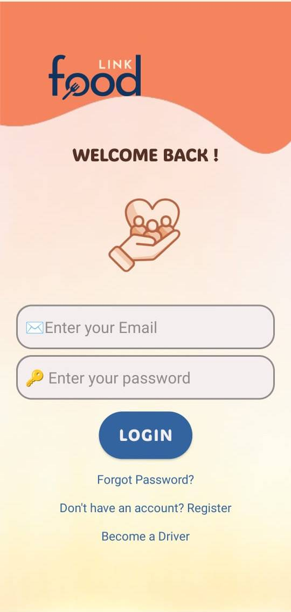
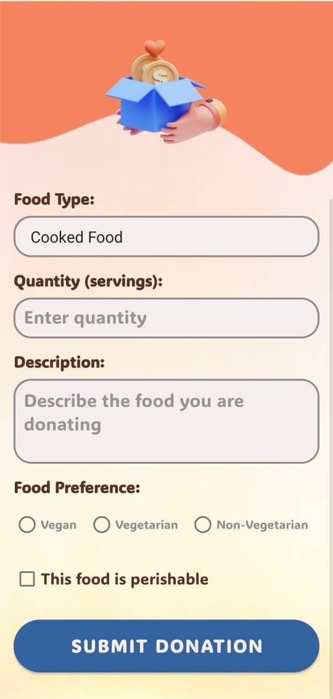

# 🍽️ FoodLink - Connecting Surplus with Need

[](https://www.android.com/)
[](https://kotlinlang.org/)
[](https://firebase.google.com/)
[](https://sdgs.un.org/)
[](LICENSE)

> *"Every meal saved is a step towards a hunger-free world"*

**FoodLink** is an Android application developed as part of the **India Gateway Program** (Nov 2024 - Mar 2025) in collaboration between students from India and **Technical University of Applied Sciences Würzburg-Schweinfurt (THWS), Germany**. The app connects people with surplus food to volunteers, NGOs, and communities in need, reducing food waste while fighting hunger.

Think of it as **Blinkit/Zepto, but for a purpose** — bridging the gap between excess and need through technology.

---

## 🎯 Project Overview

### The Problem
- **1.3 billion tonnes** of food is wasted globally every year
- **828 million people** face hunger worldwide
- Lack of efficient systems to connect donors with recipients

### Our Solution
FoodLink creates a seamless platform where:
- 🍲 **Donors** can list surplus food
- 🚚 **Volunteers & NGOs** can pick it up in real-time
- 🤝 **Communities in need** receive nutritious meals

### UN Sustainable Development Goals
This project directly contributes to:
- 🎯 **SDG 2**: Zero Hunger
- ♻️ **SDG 12**: Responsible Consumption and Production

---

## ✨ Key Features

### 🤖 AI-Powered Chatbot
- Guides users through the donation process
- Answers FAQs about food donations
- Assists with pickup coordination
- Provides real-time support

### ⚡ Smart Matching System
- **Real-time location tracking** connects donors with nearest volunteers/NGOs
- **Instant notifications** for new donation opportunities
- **Optimized routing** for efficient food pickup and delivery

### 👥 Three User Roles

**For Donors:**
- 📸 Upload food details with photos
- 📍 Set pickup location and time
- 📊 Track donation impact
- ⭐ Rate delivery partners

**For Volunteers/NGOs:**
- 🔍 Browse nearby donations
- 🚚 Accept and track deliveries
- 🗺️ Navigate to pickup/drop locations
- 📈 View delivery history

**For Recipients:**
- 🍽️ Request food items
- 📦 Track delivery status
- 💬 Communicate with donors and drivers
- ⭐ Rate and review donors

### 💬 Communication Hub
- **In-app chat** between donors, volunteers, and recipients
- **Push notifications** for status updates
- **Order history** for transparency

### 🔐 Security & Privacy
- Firebase Authentication (Email/Password)
- Secure data storage with Firestore
- User privacy protection

---

## 📱 Screenshots

> **Add your app screenshots here!** Create a `screenshots/` folder in your project.

<table>
  <tr>
    <td></td>
    <td></td>
    <td></td>
    <td></td>
  </tr>
  <tr>
    <td align="center">🔐 Login Screen</td>
    <td align="center">🏠 Home Dashboard</td>
    <td align="center">📝 Create Donation</td>
    <td align="center">💬 AI Chatbot</td>
  </tr>
</table>

---

## 🛠️ Technology Stack

### Frontend
- **Language**: Kotlin
- **UI Framework**: XML Layouts with Material Design
- **Architecture**: MVVM (Model-View-ViewModel)
- **Navigation**: Android Navigation Component

### Backend & Cloud Services
- **Backend**: Firebase
  - **Authentication**: Firebase Auth
  - **Database**: Cloud Firestore (Real-time)
  - **Cloud Messaging**: FCM for push notifications
- **Location Services**: Google Maps SDK
- **AI Integration**: Chatbot for user assistance

### Development Tools
- **IDE**: Android Studio
- **Build System**: Gradle (Kotlin DSL)
- **Version Control**: Git & GitHub
- **Design**: Figma (UI/UX Prototyping)
- **Collaboration**: Agile methodology across time zones

### Key Libraries
- **Image Loading**: Glide
- **Async Operations**: Kotlin Coroutines
- **Material Design**: Material Components for Android
- **CSV Processing**: For donation center data

---

## 🚀 Installation

### Prerequisites
- Android Studio Arctic Fox or later
- Android SDK 24+ (Android 7.0+)
- Kotlin 1.9.0+
- Firebase account
- Google Maps API key

### Setup Instructions

1. **Clone the Repository**
```bash
git clone https://github.com/sambhav302005-coder/FoodLink.git
cd FoodLink
```

2. **Firebase Configuration**
   - Create a Firebase project at [Firebase Console](https://console.firebase.google.com/)
   - Add an Android app
   - Download `google-services.json`
   - Place it in the `app/` directory

3. **Google Maps API**
   - Get API key from [Google Cloud Console](https://console.cloud.google.com/)
   - Add to `local.properties`:
   ```properties
   MAPS_API_KEY=your_google_maps_api_key
   ```

4. **Build & Run**
```bash
./gradlew build
```
   - Open in Android Studio
   - Connect device/emulator
   - Run the app (Shift + F10)

---

## 📦 Download APK

**Want to try FoodLink?** Download the latest APK from the [Releases](../../releases) section!

**Current Version**: v1.0.0  
**Min Android**: 7.0 (API 24)  
**Target Android**: 14 (API 34)

---

## 👥 Team - India Gateway Program

This project was developed through an **international collaboration** between Indian and German students as part of the India Gateway Program with THWS Germany.

| Name | Role | Country | LinkedIn |
|------|------|---------|----------|
| [Sambhav Jain](https://www.linkedin.com/in/sambhavjain~/) | Lead Developer | 🇮🇳 India | [](https://www.linkedin.com/in/sambhavjain~/) |
| [Michelle Hepp](https://www.linkedin.com/in/michelle-hepp-60986b28b/) | Developer | 🇩🇪 Germany | [](https://www.linkedin.com/in/michelle-hepp-60986b28b/) |
| [Lukas Langpeter](https://www.linkedin.com/in/lukaslangpeter/) | Developer | 🇩🇪 Germany | [](https://www.linkedin.com/in/lukaslangpeter/) |
| [Anurag Mandal](https://www.linkedin.com/in/anurag-mandal-084428241/) | Developer | 🇮🇳 India | [](https://www.linkedin.com/in/anurag-mandal-084428241/) |
| [Isar Kaur](https://www.linkedin.com/in/isar-kaur-b140742bb/) | UI/UX Designer | 🇮🇳 India | [](https://www.linkedin.com/in/isar-kaur-b140742bb/) |

### 🌍 Cross-Cultural Collaboration
**Timeline**: November 2024 - March 2025

This project represents a unique blend of perspectives:
- 🌐 **50% Remote Collaboration**: Overcoming time zones and cultural differences
- 🤝 **50% In-Person Work**: Intensive collaboration in India
- 🔄 **Agile Workflow**: Adapted to accommodate international team dynamics
- 💡 **Diverse Perspectives**: Combining Indian and German approaches to problem-solving

**Key Learnings**:
- Patience and adaptability in cross-cultural communication
- Balancing different work styles and time zones
- The value of diverse perspectives in creating impactful solutions
- How empathy, teamwork, and innovation can tackle real-world problems

---

## 🎓 Academic Partnership

<table>
  <tr>
    <td align="center" width="50%">
      <h3>🇮🇳 India</h3>
      <p><strong>Partner Universities</strong></p>
      <p>Various Indian institutions</p>
    </td>
    <td align="center" width="50%">
      <h3>🇩🇪 Germany</h3>
      <p><strong>THWS</strong></p>
      <p>Technical University of Applied Sciences<br/>Würzburg-Schweinfurt</p>
    </td>
  </tr>
</table>

**Program**: India Gateway Program  
**Duration**: 5 months (Nov 2024 - Mar 2025)  
**Focus**: Sustainable Development & Social Innovation

---

## 📂 Project Structure

```
FoodLink/
├── app/
│   ├── src/main/
│   │   ├── java/com/example/igp/
│   │   │   ├── ChatActivity.kt              # AI Chatbot interface
│   │   │   ├── DonationFragment.kt          # Food donation form
│   │   │   ├── DeliveryTrackerFragment.kt   # Real-time tracking
│   │   │   ├── DriverFragment.kt            # Volunteer dashboard
│   │   │   ├── HomeFragment.kt              # Main dashboard
│   │   │   ├── LoginFragment.kt             # Authentication
│   │   │   ├── ProfileFragment.kt           # User profile
│   │   │   ├── FirebaseUtil.kt              # Firebase operations
│   │   │   └── NotificationHelper.kt        # Push notifications
│   │   ├── res/                             # Resources
│   │   ├── assets/
│   │   │   └── donation_centers.csv         # NGO/center data
│   │   └── AndroidManifest.xml
│   └── google-services.json                 # (Add your own)
├── screenshots/                              # App screenshots
├── docs/
│   └── FoodLink-Presentation.pdf            # Project presentation
├── .gitignore
├── README.md
└── build.gradle.kts
```

---

## 🎯 How It Works

### For Donors
1. **Register** on FoodLink
2. **Post** surplus food with details and photo
3. **Get matched** with nearby volunteers/NGOs
4. **Coordinate** pickup time
5. **Track** delivery and see your impact

### For Volunteers/NGOs
1. **Sign up** as a delivery partner
2. **Browse** available donations nearby
3. **Accept** delivery requests
4. **Pick up** from donor location
5. **Deliver** to recipient/food bank
6. **Track** your contribution

### For Recipients
1. **Create** an account
2. **Search** for food donations nearby
3. **Request** items you need
4. **Receive** delivery confirmation
5. **Rate** the experience

---

## 🌟 Impact & Vision

### Our Impact So Far
- 🍽️ Connecting donors with communities in need
- ♻️ Reducing food waste at the source
- 🤝 Building a network of conscious citizens
- 📊 Creating transparency in food donation

### Future Roadmap
- [ ] AI-powered food expiry prediction
- [ ] Integration with more NGOs and food banks
- [ ] Multi-language support (Hindi, German, English)
- [ ] Analytics dashboard for organizations
- [ ] iOS version
- [ ] Gamification for donor engagement
- [ ] Carbon footprint calculator
- [ ] Corporate partnership program
- [ ] Web admin panel for NGOs

---

## 🤝 Contributing

We welcome contributions from the community! Here's how you can help:

1. **Fork** the repository
2. **Create** a feature branch (`git checkout -b feature/AmazingFeature`)
3. **Commit** your changes (`git commit -m 'Add some AmazingFeature'`)
4. **Push** to the branch (`git push origin feature/AmazingFeature`)
5. **Open** a Pull Request

### Areas We Need Help
- 🌐 Translations (Hindi, German, regional languages)
- 🎨 UI/UX improvements
- 🤖 AI chatbot enhancements
- 📱 iOS development
- 📊 Analytics features
- 🧪 Testing and bug fixes

---

## 📄 License

This project is licensed under the MIT License - see the [LICENSE](LICENSE) file for details.

---

## 📞 Contact & Support

**Project Repository**: [github.com/sambhav302005-coder/FoodLink](https://github.com/sambhav302005-coder/FoodLink)

**For Inquiries**:
- 📧 Reach out via LinkedIn to any team member
- 🐛 Report bugs via [GitHub Issues](https://github.com/sambhav302005-coder/FoodLink/issues)
- 💡 Suggest features via [GitHub Discussions](https://github.com/sambhav302005-coder/FoodLink/discussions)

---

## 🙏 Acknowledgments

- **THWS Germany** for facilitating the India Gateway Program
- **Firebase** for robust backend infrastructure
- **Google Maps** for location services
- **Material Design** team for UI components
- All **volunteers and NGOs** using FoodLink to make a difference
- Our **mentors and professors** who guided us throughout
- The **open-source community** for inspiration

---

## 📸 Presentation, Design & Demo

📄 **[View Project Presentation](docs/FoodLink-Presentation.pdf)**  
🎨 **[View Figma Design](https://www.figma.com/design/nFG19Vfagomt2btpqPXJUq/Untitled?node-id=0-1&t=WvSs79q4v3w5yyth-1)** - UI/UX Prototypes  
🎥 **Demo Video**: Coming soon on YouTube!

---

## 🌍 Global Goals, Local Action

FoodLink demonstrates how technology can be more than code — it's a tool for solving real problems and creating meaningful change. By bringing together students from India and Germany, we've shown that collaboration across borders can lead to innovative solutions for global challenges.

**Together, we can:**
- 🎯 Achieve Zero Hunger (UN SDG 2)
- ♻️ Promote Responsible Consumption (UN SDG 12)
- 🤝 Build sustainable communities
- 🌱 Create a more equitable food system

---

<div align="center">

**Made with ❤️ by students from India 🇮🇳 and Germany 🇩🇪**

*Fighting hunger, reducing waste, one meal at a time*

[](https://github.com/sambhav302005-coder/FoodLink)
[](https://github.com/sambhav302005-coder/FoodLink/fork)

</div>
